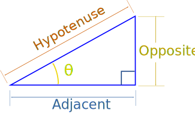
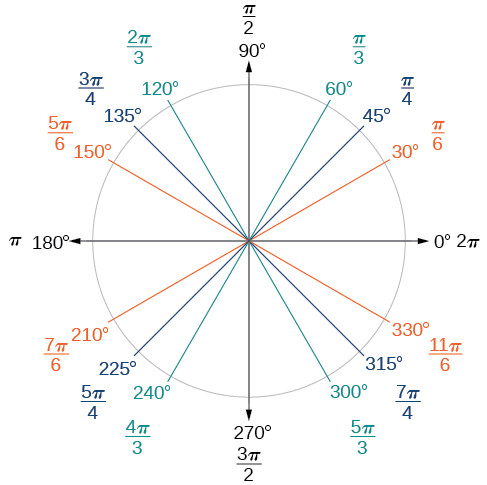
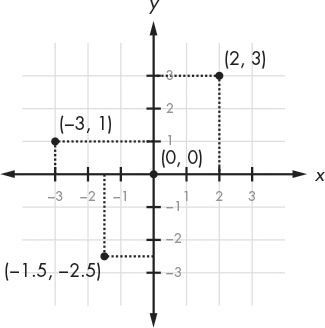
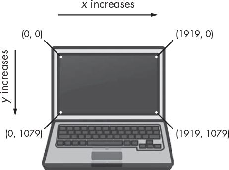

# tut-js-cm

[Coding Math](https://github.com/bit101/CodingMath) tutorials

## Trig Formulas

$sin\theta = \frac{opposite}{hypotenuse}$

$cos\theta = \frac{adjacent}{hypotenuse}$

$tan\theta = \frac{opposite}{adjacent}$

$degrees = \frac{radions \cdot 180}{\pi}$
$radians = \frac{degrees \cdot \pi}{180}$

## Coordinate Systems

##Image Sources
[Source for Right angle triangle](https://www.mathsisfun.com/sine-cosine-tangent.html)
[Source for Unit Circle](https://courses.lumenlearning.com/boundless-algebra/chapter/trigonometric-functions-and-the-unit-circle/)
[Cartesian and Screen Coordinates](https://inventwithpython.com/invent4thed/chapter12.html)
